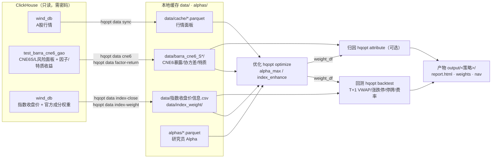

# HistQuantOpt 团队操作指南

面向团队成员的上手手册：怎么准备数据、怎么跑、参数怎么设、默认值是什么。

框架支持两条策略流水线，都是「Alpha → 优化 → 真实回测 → HTML 报告」的完整闭环：

| 策略 | 选股范围 | 默认基准 | 一站式命令 |
|---|---|---|---|
| **量化选股** (alpha_max) | 全市场 | 全市场等权 | `hqopt run configs/alpha_max_default.yaml` |
| **指数增强** (index_enhance) | 全市场(成分≥80%) | 中证1000 | `hqopt run configs/index_enhance_default.yaml` |

---

## 1. 环境与数据准备

### 1.1 安装
克隆仓库后，在项目根执行：

支持 Python **3.12** 与 **3.14.6**，日常及 CI 以 3.14.6 为主。

```bash
pip install -e .          # 装依赖 + 注册 hqopt 命令
```

之后用 `hqopt <子命令>`。若提示 `command not found`（pip 的 user-bin 不在 PATH），
改用完全等价的 `python -m hqopt <子命令>`。

子命令：`run`（一站式：优化→回测→报告）/ `optimize`（只优化）/ `backtest`（只回测）/
`rotate`（选股列表→轮动分仓回测，见 [§ 2.1](#21-轮动分仓回测hqopt-rotate)）/
`attribute`（只归因）/ `data`（数据准备）。

### 1.2 数据流全景



只跑 `hqopt run`（不重新拉数）时只依赖 B1~B4 这四类本地文件；重新拉数/刷新缓存才需要连 ClickHouse（见 1.5）。

> **数据源复核（2026-07-17）**：原行情视图 `the_quant.vw_ashare_daily_backtest`
> 已迁移为 `wind_db.VW_ASHARE_STOCK_DAILY`。已核对线上 76 列实际 schema，脚本使用字段
> 全部存在；并抽样比对线上原始值、本地缓存及 `adj_vwap` / `free_mv` 派生值，结果一致。
> `hqopt data sync` 已恢复可用，本地 `data/cache/` 当前覆盖到 2026-07-16。

### 1.3 六类输入数据
跑回测前，`data/` 下需备齐这六类（多数从 ClickHouse 拉，需只读密码；部分由脚本生成）：

| 数据 | 位置 | 来源 / 生成 |
|---|---|---|
| A股全市场行情 | `data/cache/ashare_daily_<year>.parquet` | `hqopt data sync`（wind_db.VW_ASHARE_STOCK_DAILY） |
| CNE6 风险模型 | `data/barra_cne6_S/`、`data/barra_cne6_L/` | `hqopt data cne6`（test_barra_cne6_gao） |
| 因子/特质收益（收益归因用） | 两个CNE6目录下的 `{factor_return,specific_return}.parquet` | `hqopt data factor-return`（分别与S/L风险模型同源） |
| 指数日收盘价（回测基准） | `data/指数收盘价信息.csv` | `hqopt data index-close`（wind_db，6 宽基指数） |
| 指数成分权重（指增基准权重） | `data/index_weight/official_weight.parquet` | `hqopt data index-weight`（官方快照；运行时默认 PIT 漂移） |
| Alpha 因子值 | `alphas/*.parquet` | 研究员模型，或 `python scripts/build_alphas_vwap5.py`（合成，含前视，仅测试） |

数据契约在仓库根目录 `data_manifest.yaml`，包含必需文件、字段和最低日期覆盖。运行前校验：

```bash
python scripts/verify_data_bundle.py --profile default \
  --lock data_bundle.default.lock.json
python scripts/verify_data_bundle.py --profile attribution \
  --lock data_bundle.attribution.lock.json
python scripts/verify_data_bundle.py --profile long_risk \
  --lock data_bundle.long_risk.lock.json
python scripts/verify_data_bundle.py --profile attribution_long \
  --lock data_bundle.attribution_long.lock.json
```

### 1.4 团队数据交接

`data/`、`alphas/` 不进入 Git。当前由维护者通过团队批准的加密存储交付版本化数据包，
同时交付 SHA-256 锁文件；不要通过聊天粘贴、邮件明文或仓库提交传输数据。

发送方先校验，再生成锁文件：

```bash
python scripts/verify_data_bundle.py --profile attribution \
  --write-lock data_bundle.attribution.lock.json
```

随后打包锁文件列出的实际文件。若 `data/cache` 是软链接，打包时必须复制其目标文件内容，
不能只交付软链接。接收方解包到项目根目录后执行：

```bash
python scripts/verify_data_bundle.py --profile attribution \
  --lock data_bundle.attribution.lock.json
```

只有全部显示 `[OK]` 才能运行策略。`hqopt run` 与 `hqopt optimize` 也会在加载行情前
强制执行同一校验。未显式设置 `data.lock` 时，按 profile 自动读取
`data_bundle.<profile>.lock.json`；默认档仍兼容旧的 `data_bundle.lock.json`。
失败即终止。`data.root` 相对 YAML 所在目录解析，其他项目路径均相对该根目录；
这也是 wheel 脱离源码树运行时的数据入口：

```yaml
data:
  root: ".."
  profile: long_risk
  manifest: data_manifest.yaml
  # lock: data_bundle.long_risk.lock.json  # 可省略，按 profile 自动选择
```

锁文件校验失败时应重新传输，禁止跳过校验继续使用；数据更新后由发送方重新生成锁文件，
旧锁文件不得复用。CLI 覆盖的真实 Alpha 会另行写入运行清单并绑定 SHA-256。

### 1.5 ClickHouse 连接（仅数据维护者拉数用）
密码只走环境变量，不入代码/git。默认统一使用一个只读密码；旧变量仍兼容：

```bash
# wind_db / test_barra_cne6_gao（行情 / CNE6 / 因子收益 / 指数数据）
export CLICKHOUSE_WIND_PASSWORD='...'   # 推荐：统一只读密码
# export CLICKHOUSE_PASSWORD='...'      # 兼容旧环境；同时设置时优先使用此变量
export CLICKHOUSE_SCHEME='https'         # 默认值；使用系统 CA 校验证书
# export CLICKHOUSE_CA_FILE='/path/to/internal-ca.pem'  # 私有 CA 时设置

hqopt data sync          # 导出 A 股行情缓存
hqopt data cne6          # 导出 CNE6 面板（区间改 scripts/export_cne6_panels.py 顶部 START/END_DATE）
hqopt data factor-return # 导出因子/特质收益（区间改 scripts/export_factor_attribution.py 顶部 START/END_DATE）
hqopt data index-close   # 导出指数日收盘价 → CSV（覆盖前自动备份 .bak）
hqopt data index-weight          # 导出官方月度/调样快照
hqopt data index-weight --daily  # 同时导出 official_weight_daily.parquet
```

客户端不会从 HTTPS 自动降级。仅在受控内网兼容遗留明文端口时，必须同时显式设置
`CLICKHOUSE_SCHEME=http` 与 `CLICKHOUSE_ALLOW_INSECURE_HTTP=1`，运行时会打印危险告警。

> - CNE6 在 ClickHouse 覆盖 2014~2026；回测区间早于已导出面板的调仓日会被自动跳过。
> - 指数增强默认使用 `official_drift`：官方快照按 as-of 取最近期，再用后复权收盘价
>   漂移到 T 日；快照日原值、停牌只前向取价，严禁使用未来快照。成分变化、价格缺失
>   或官方未覆盖时回退 free_mv 重构并写入 `benchmark_quality`。快照默认最多陈旧
>   30 个自然日，可用 `optimizer.benchmark_max_snapshot_age_days` 修改。
> - `--daily` 调用运行时同一实现，输出 T 日收盘权重；`date` 是 T 日观测日，
>   `effective_date` 是下一交易日，外部回测/交易必须用后者，不能用于 T 日收益。
>   其余审计列含 `anchor_date/snapshot_age_days/method/fallback_reason`；原始
>   `official_weight.parquet` 保留为不可替代的快照输入。
>   万得全A 在 wind_db 无，已用中证全指替代（`winda` 别名指向中证全指）。

---

## 2. 快速开始

数据备齐后，一行命令跑完整流程（优化 → 回测 → 报告）：

```bash
python scripts/verify_data_bundle.py --profile default \
  --lock data_bundle.default.lock.json
hqopt run configs/alpha_max_default.yaml        # 量化选股（全市场等权基准）
hqopt run configs/index_enhance_default.yaml    # 指数增强（中证1000）
```

产物在 `output/<策略>_default/`：`report.html`（交互报告）、`weights.parquet`、
`weights.sell_only.parquet`、`weights.sell_only.manifest.json`、`nav.parquet`、`turnover.parquet`、
`actual_weights.parquet`、执行统计 JSON，以及项目级运行清单。

默认配置里的 Alpha 是含未来信息的合成信号，只用于跑通流程；终端和产物目录会显示提醒，
HTML 报告不加水印。生产研究换成真实 Alpha 时，先在 YAML 中显式设置
`alpha.source: file` 和 `alpha.synthetic: false`，再运行
`hqopt run <config> --alpha-file <parquet>`。`--alpha-file` 只覆盖路径，不会推断或
清除可信度标记；Python API 即使传入预载 `alpha_df`，也会先校验这两项。改参数直接
编辑 `configs/*.yaml`。

分步用法：

```bash
# 只优化出权重（--risk-aversion / --output / --alpha-file 可覆盖配置）
hqopt optimize configs/index_enhance_default.yaml

# 只回测 + 报告（权重可来自任意来源）
# --risk-free 不传时默认 0.02；--out-dir 可省略
# --alpha-path 可选：不传则报告"最后一期目标持仓"表的 Alpha 列显示—
hqopt backtest --weights output/index_enhance_default/weights.parquet \
    --start 2020-01-01 --end 2026-05-31 --index zz1000 \
    --alpha-path alphas/alpha_vwap5_ic0.10_icir0.8_decay0.80.parquet
```

独立 `backtest` 未指定 `--out-dir` 时，项目 `output/` 内的权重写回所属策略目录；
外部权重统一写到 `output/backtest/`。

### 2.1 轮动分仓回测（hqopt rotate）

与组合权重回测互补的**信号驱动**回测：选股策略只负责每日给出股票列表，
回测按固定持有期滚动轮换。

**语义**：T 日（信号日）选出任意只股票 → T+1 日以**复权开盘价**买入（桶内
逐票等权）→ T+H 日以**复权收盘价**卖出。资金分成 H 份（桶），每日建仓金额
= min(前收盘总资产 / H, 可用现金)；连续无信号时持仓逐桶卖光、资金自然回到
全现金，下次有信号从「总资产 / H」重新起步，无需显式重置。

```bash
# 选股文件：parquet/csv 长表，列 [date, code]，date=信号日 T，多余列忽略
hqopt rotate --picks picks.parquet --hold-days 5 \
    --start 2020-01-01 --end 2026-05-31 \
    --index equal_weight --out-dir output/my_rotate
# 其余可选参数：--cost-buy 0.001 --cost-sell 0.002 --initial-value 1e8
#              --risk-free 0.02 --title "报告标题"
```

执行口径（与 `backtest` 的 `RealisticBacktester` 同容差）：

| 场景 | 处理 |
|---|---|
| T+1 开盘涨停（open ≥ limit_up×99.9%）/ 停牌 | 放弃该票，资金留现金 |
| T+H 收盘跌停（close ≤ limit_down×100.1%）/ 停牌 | 顺延到下一个可交易日收盘卖出 |
| 退市（当日行情整行消失） | 不论是否到期，当日按最近有效收盘价强制卖出核销 |
| 现金耗尽（到期桶被跌停/停牌卡住未回款） | 当期信号整桶跳过，计入 `no_cash_skip_days` |

估值用 ffill 复权收盘价（停牌沿用最近有效价），成交价不 ffill。

产物在 `--out-dir`（默认 `output/rotate/`）：`report.html`（与三条策略流水线
同一套报告，含年度分解）、`nav.parquet`、`turnover.parquet`、
`actual_weights.parquet`、`trades.parquet`（逐笔成交，`sell_deferred`/
`sell_delist` 标记顺延与退市核销）、`execution_stats.json`（含
`buy_fail_breakdown` / `sell_defer_breakdown` 按停牌/涨跌停/无行情分列的
阻断统计）。

配套工具 `scripts/gen_random_picks.py`：每日从全市场随机选 0~K 只生成基线
信号，用于压测执行成本与阻断处理是否引入系统性偏差。

---

## 3. 配置参数详解

配置文件由 `strategy` / `data` / `backtest` / `universe` / `optimizer` / `alpha` /
`execution` / `output` 组成。
下面「config 默认」指配置里**不写该键**时的取值；标「必填」的不写会报错。

### 3.1 顶层 + backtest

| 键 | 必填 | 默认 | 说明 |
|---|---|---|---|
| `strategy` | 必填 | — | `index_enhance` 或 `alpha_max` |
| `index` | 必填 | — | 指增：`hs300/zz500/zz1000`；量选全市场：`all` |
| `data.root` | 否 | 源码仓库根 | 数据与输出根目录；YAML 中的相对值按 YAML 所在目录解析，wheel 运行建议显式配置 |
| `data.profile` | 否 | 自动推导 | 数据锁 profile；CNE6L 自动推导为 `long_risk`，也可显式设置 |
| `data.manifest` / `lock` | 否 | 根目录清单 / 分档锁 | 相对 `data.root`；锁默认 `data_bundle.<profile>.lock.json` |
| `backtest.start_date` / `end_date` | 必填 | — | ISO 日期，如 `"2020-01-01"` |
| `backtest.rebalance_freq` | 必填 | — | 换仓周期（交易日），常用 **10**（约双周）或 20（约月频） |
| `backtest.initial_value` | 必填 | — | 初始资金（元），如 `100000000` |

### 3.2 universe（候选池）

| 键 | 默认 | 说明 |
|---|---|---|
| `exclude_bj` | `true` | 剔除北交所 |
| `exclude_st` | `true` | 剔除 ST |
| `top_n` | `null` | 按自由流通市值取前 N，`null`=不限（全市场） |
| `new_listing_days` | `120` | 次新股判定：上市不足此自然日数（`list_days < 该值`）禁止持仓，无持仓强制 `zero`、有持仓强制 `sell_only`（见 [`RealMarketAdapter._compute_status`](../hqopt/data/real_adapter.py)） |

> 两条策略候选池相同（全市场剔北交所+ST）。指数增强不另限宽基，靠 `optimizer.min_constituent_ratio`
> 把目标指数成分托到 ≥下限（默认 80%），剩余配全市场（泛化指增）。
> 量化选股使用 `index: all` 时，「成分股」特指
> **沪深300 ∪ 中证500 ∪ 中证1000**，不是全部候选股票；默认至少 40% 权重落在该并集。
> 若成分掩码错误地全为 True，优化器会报错，避免约束空转。

### 3.3 optimizer —— 指数增强 (index_enhance)

| 键 | 必填 | 默认 | 含义 / 建议 |
|---|---|---|---|
| `weight_upper` | 必填 | — | 单票权重上限，如 `0.01`(1%) |
| `min_constituent_ratio` | 必填 | — | 成分股权重之和下限，如 `0.80` |
| `industry_active_bound` | 必填 | — | 行业相对基准偏离 ±，如 `0.07`(±7%) |
| `style_active_bound` | 必填 | — | 风格暴露 ±σ。**标量**统一，或 **dict** 按因子分别约束（见下） |
| `tracking_penalty` | 必填 | — | 跟踪误差 L2 惩罚 γ，越大越贴基准，常用 `10.0` |
| `max_turnover` | 否 | `null`(不限) | 双边换手硬上限，如 `0.40` |
| `turnover_penalty` | 否 | `0.0` | 换手软惩罚 λ（0.005~0.1 轻→重） |
| `active_weight_upper` | 否 | `null` | 单票主动偏离硬上限 `|w_i−w_bm_i|≤δ`，如 `0.01`(±1%)；`null`=不约束 |
| `weight_diff_l2_bound` | 否 | `null` | `‖w−w_bm‖₂` 硬约束，一般不用 |
| `cne6_data_dir` | 否 | `null`(→短周期S) | 改 `data/barra_cne6_L` 用长周期 |
| `risk_aversion` | 否 | `null` | 设置则用 CNE6 因子协方差做真跟踪误差进目标；不设用 L2 惩罚 |
| `te_upper` | 否 | `null` | **年化 TE 硬上限**（`0.05`=5%）。启用后目标函数风险项自动关闭，与 `risk_aversion` 互斥（同设报错）；需传 `risk_snapshot`。仅上限，无下限 |
| `min_risk_coverage` | 否 | `0.90` | 指数基准权重的 CNE6 最低覆盖率；不足时跳过该期优化并告警（2020年初实测约93%，勿设过高） |

**`te_upper` vs `risk_aversion` 怎么选**：两者是同一有效前沿的两种参数化。
想**直接把 TE 定在 5%** 用 `te_upper: 0.05`（结果可控、无需调参）；
想**在收益与风险间自行权衡**用 `risk_aversion`（TE 由 λ 间接决定、需试参）。
不要同时设——会报错，这是刻意设计，避免误以为两者能叠加生效。

**风格单因子分别约束**（`style_active_bound` 写 dict，`default` 为兜底，未列出因子用 default）：

```yaml
style_active_bound:
  default: 0.50
  Size: 0.30          # 市值中性收紧
  Momentum: 0.20      # 动量收紧
```

CNE6L 16 个核心风格因子名：`Size MidCap Beta Momentum ResidualVolatility LongTermReversal
Liquidity Value EarningsYield Growth Profitability InvestmentQuality EarningsQuality
EarningsVariability Leverage DividendYield`

CNE6S 额外包含4个快策略风格：`AnalystSentiment IndustryMomentum Seasonality
ShortTermReversal`，因此S共20个风格、51个总因子；L共16个风格、47个总因子。
空值、空字符串和“未知”行业不进入30个行业因子，协方差行列也会同步过滤。

**指数增强默认模板**：见 [configs/index_enhance_default.yaml](/Users/guoguo/Documents/HistQuant/HistQuantOpt/configs/index_enhance_default.yaml:1)

### 3.4 optimizer —— 量化选股 (alpha_max)

| 键 | 必填 | 默认 | 含义 / 建议 |
|---|---|---|---|
| `weight_upper` | 必填 | — | 单票上限，如 `0.02` |
| `industry_upper` | 否 | `0.20` | 单行业权重绝对上限 |
| `min_constituent_ratio` | 否 | `0.0` | 沪深300∪中证500∪中证1000 权重下限；团队默认模板为 `0.40` |
| `diversification_penalty` | 否 | `0.05` | 分散度惩罚，调大→持仓更分散 |
| `style_bound` | 否 | `null` | 风格绝对暴露上限。可写标量统一，或写 `dict` 按因子分别约束 |
| `max_turnover` | 否 | `null` | 双边换手硬上限 |
| `turnover_penalty` | 否 | `0.0` | 换手软惩罚 |
| `cne6_data_dir` / `risk_aversion` | 否 | `null` | 同上 |
| `vol_upper` | 否 | `null` | **年化组合波动率硬上限**（`0.20`=20%）。启用后目标函数风险项自动关闭，与 `risk_aversion` 互斥（同设报错）；需传 `risk_snapshot`。仅上限，无下限 |

**量化选股默认模板**：见 [configs/alpha_max_default.yaml](/Users/guoguo/Documents/HistQuant/HistQuantOpt/configs/alpha_max_default.yaml:1)

```yaml
style_bound:
  default: 0.50
  Size: 0.20
  Beta: 0.20
  Liquidity: 0.20
  ResidualVolatility: 0.20
  Momentum: 0.30
  Value: 0.50
  Growth: 0.50
```

### 3.5 alpha（因子来源）

```yaml
alpha:
  source: file                              # 必填，无默认值：file（外部因子）| synthetic（合成，测试用）
  path: "alphas/xxx.parquet"                # source=file 时必填；长表(code,date,alpha)或宽表均可
  synthetic: false                          # 必须显式声明；--alpha-file 不会替你改写
  standardize: true                         # 默认 true，优化域内截面 z-score
  max_staleness_days: 15                    # file 默认 15 自然日；超限跳过
```
`source` 字段必须显式指定，缺失会直接报错——不接受默认兜底，防止漏配时误用前视信号。
合成模式（`source: synthetic`）需 `ic_mean / ic_std / decay / fwd_days / seed`，仅用于标定，**含前视**。
批量 bundle 仍把 `alpha_quality.synthetic` 写入成交统计并由 manifest 绑定 SHA-256，
供运行审计使用；HTML 报告不展示合成 Alpha 水印。

**Alpha 面板的 `date` 语义 = 信号可得日**：T 日那一行只能用 T 日及之前的信息构造。
优化器在 T 日收盘后据此下单、T+1 成交，因此按 `<= 调仓日` 取值不构成前视；若把
"预测目标日"写进 `date` 列则会引入前视——这由 Alpha 生产方保证，框架无法检测。

| 键 | 默认 | 说明 |
|---|---|---|
| `standardize` | `true` | 对优化域内 Alpha 做截面 z-score。目标函数 `w'α − γ·R(w)` 中 α 与风险/成本系数量纲耦合：**同一因子排序，α 乘 100 倍就能把 γ=0.05 下的 20 只分散组合压成 1 只全仓**。标准化后 `risk_aversion` / `turnover_penalty` / `diversification_penalty` 的默认标定才稳定，缺失票填 0 也才等于「截面中性」。仅当因子已自行标准化时才设 `false`。 |
| `max_staleness_days` | file 默认 `15` | 调仓日与实际取用的 Alpha 日期相差超过 N 个**自然日**时，跳过该期优化（账本继续执行原目标），计入失败期数。`null` 仅用于显式调试模式：只告警、不硬跳过。 |

**陈旧 Alpha 的告警**：无论是否设 `max_staleness_days`，陈旧超过
`max(rebalance_freq × 3, 7)` 个自然日都会逐期 WARNING，并在汇总行报告
「最大陈旧日数 / 告警期数 / 因过期跳过期数」。研究员的 Alpha 文件比回测区间短是常见
情况——此前会静默沿用最后一期信号跑完剩余区间，业绩看似仍在赚钱，实则由过期信号驱动。

其他 fail-closed 情况：Alpha 面板**整体晚于**回测区间会抛 `ValueError`；某期 Alpha
对优化域**零覆盖**时跳过；有效截面为常量、全零或零方差时也跳过，防止优化静默退化成
纯风险最小化。覆盖率低于 50% 但仍有至少两只有差异的有效值时告警并继续。

### 3.6 execution（回测成本）

| 键 | 默认 | 说明 |
|---|---|---|
| `cost_buy` | `0.001` | 买入费率（1‰） |
| `cost_sell` | `0.002` | 卖出费率（2‰） |
| `risk_free` | `0.02` | 年化无风险利率（算 Sharpe 用） |

> T 日优化使用成交账本的实际权重做换手/风险约束，但 **T 日涨跌停不限制新目标**，
> 因为收盘时不知道 T+1 是否能成交。T 日停牌持仓的目标权重固定为实际权重，并在
> 整个目标生命周期内冻结股数；即使 T+1 复牌也不交易。
>
> T+1 按 VWAP 先卖后买，只处理 pending 股票：涨停不可买、跌停不可卖、停牌或
> VWAP 无效不可交易。已成交股票本期锁定；现金不足时，可交易买单同比例部分成交。
> 未成交单最多再试 T+2、T+3，T+3 后残余转为过期，直到下一调仓目标才重新激活。
> 普通 pending 按最新 NAV 和原目标重新判断买卖方向；掉池或 CNE6 未覆盖持仓仍为
> sell_only，只能卖、不能反向买。只有成功生成并提交新目标才形成有效调仓日；该日
> 盘中先执行旧目标，收盘再提交新目标并覆盖剩余订单、重置状态/计数，下一交易日才是
> 新目标的 T+1。若快照、风险覆盖或求解失败导致没有新权重行，则该日不构成有效调仓，
> 旧目标保持激活并在后续交易日继续尝试。
>
> 已有持仓若当日无 panel 行情，不进入当期优化域，但仍按最近有效价格保留在真实
> 账本中：股数不变、不释放现金，不清零其权重，也不重新归一化其余目标。

`hqopt backtest` 命令行支持 `--risk-free <float>`；不传时使用默认值 0.02。只有 `hqopt run` 会读取 YAML `execution.risk_free`。

---

## 4. 输出与报告

每次跑完，`output/<策略>_default/` 下（`hqopt run` 用配置里 `output.weights` 的目录）：

| 产物 | 说明 |
|---|---|
| `report.html` | 交互式回测报告（净值/回撤/年度分解/月度超额/换手/最后一期优化器目标持仓；plotly 内嵌，离线可看） |
| `weights.parquet` | 调仓权重矩阵（date × ticker） |
| `weights.sell_only.parquet` | 每个调仓日的只卖不买矩阵；回测/归因自动读取 |
| `weights.sell_only.manifest.json` | manifest v2；用 SHA-256 绑定权重、只卖矩阵和批量执行统计，最后原子发布 |
| `batch_execution_stats.json` | 常规权重的成交、优化期数、求解后约束残差与 `alpha_quality` 审计统计；自定义权重名改用 `<weights stem>.batch_execution_stats.json` |
| `run.<run_id>.manifest.json` | 单次运行不可覆盖清单：绑定提交/脏差异、有效参数、输入文件、运行环境和全部产物 SHA-256 |
| `run.manifest.json` | 最近一次运行清单入口；内容与对应唯一清单一致 |
| `nav.parquet` / `turnover.parquet` | 逐日净值与实际成交换手。`turnover.parquet` 按**成交日**计：一次调仓若在 T+1 未成交完、顺延到 T+2/T+3，会各占一行 |
| `actual_weights.parquet` | 成交、费用和价格漂移后的逐日实际股票权重 |
| `execution_stats.json` | 回测执行统计：过期订单、未成交金额、最终股数和订单状态 |
| `report_data/*.parquet` | 报告展示数据：timeseries / turnover / metrics / yearly / monthly_excess / holdings。其中 `turnover` 按**调仓期**聚合（与报告卡片、柱状图同口径），行数=调仓次数，与顶层逐成交日的 `turnover.parquet` 语义不同；`holdings` 是最后一期优化器目标持仓，含 alpha 列（无持仓数据时不生成该文件） |
| `attribution/attribution_report.html` | 独立交互式归因报告；Plotly 内嵌，离线可看 |
| `attribution/attribution_*.{csv,parquet,json}` | 归因汇总、逐日/逐因子明细及成交重放统计 |

常规 `weights.parquet` 使用 `batch_execution_stats.json`；自定义权重文件使用
`<weights stem>.batch_execution_stats.json`，同目录多 bundle 互不覆盖。统计内的
`optimization` 保存候选/成功/失败期数、`post_solve_validation`（$10^{-5}$ 绝对容差、
逐期最大残差和失败明细）及 `target_turnover`（见下），`benchmark_quality` 保存基准来源、逐期快照日、漂移方式与
回退原因，`alpha_quality` 保存标准化、陈旧阈值、最大陈旧度、跳过/零方差期数及逐期
as-of 日期，并与权重一起受 bundle manifest 和项目级 run manifest 哈希绑定。

**`optimization.target_turnover`（目标换手，三口径逐期落盘）**

| 字段 | 含义 |
|---|---|
| `gross` | `Σ|w_target − w_prev_actual|`。`w_prev` 取自成交账本实际持仓，**不含现金**（Σ<1），故 gross 包含「把上期留存现金买回股票」那一段 |
| `cash_gap` | `1 − Σw_prev`，上述现金重投所必需的买入量 |
| `net` | `gross − cash_gap`，股票间真实调仓强度。**这才是与 `max_turnover` 直接可比的量**——该约束实际写作 `gross ≤ max_turnover + cash_gap`，等价于 `net ≤ max_turnover`。用 gross 对照 `max_turnover` 会高估调仓强度 |

`gross_mean` / `net_mean` / `cash_gap_mean` 为各口径均值，`by_period` 为逐期明细
（首期无「上期」故不计入）。终端汇总行同时打印净换手与含现金重投的换手。

> **目标换手 ≠ 成交换手**：这里记录的是优化器**想**换多少；回测报告里的换手是
> **实际**换了多少（受涨跌停、停牌、现金不足影响），两者不应互相校验。

`hqopt run/optimize/backtest/attribute` 都会在各自输出目录原子发布唯一
`run.<run_id>.manifest.json` 和最新入口 `run.manifest.json`；异常运行也会保存
`status=failed`、错误类型和信息。独立 `backtest/attribute` 没有 YAML 绑定的数据锁，
因此清单会如实记录 `data_lock.verified=false` 和
`quality_checks.data_lock=not_verified`，同时绑定权重、已有 sell-only/batch bundle
配套文件及全部输出 SHA-256，不把未校验状态伪装成通过。Python API 在
`out_dir=None` 的纯内存调用保持无文件副作用。

批量优化发布三项 bundle 时，全部产物先写 sibling 临时文件，再建立
`<weights stem>.bundle.in_progress`；旧 manifest 失效后，依次原子替换 sidecar、
对应统计、weights，最后原子发布 manifest v2 并清除标记。正式替换的整个区间持
该权重绝对路径对应的跨进程独占锁；回测/归因从 manifest/sidecar 校验到
weights+sidecar 读取完成，全程持同路径共享锁，避免混读新旧版本或两个发布进程
交错替换。

回测/归因遇到发布中标记、批量 manifest 缺失、清单不完整、哈希或结构错配时都会
拒绝读取；已有 manifest v1 保持兼容。自行提供的外部权重若完全没有 sidecar、
manifest 和 marker，可以在明确告警后继续运行；若存在其中任一配套文件或标记，
则必须满足相应 bundle 契约。

### 绩效指标口径

| 指标 | 计算 |
|---|---|
| 年化收益 | `(1+total)^(252/n) − 1`（几何） |
| 超额收益（分年） | `(1+组合累计)/(1+基准累计) − 1`（几何，行业标准） |
| 年化超额（全期） | `(1+组合累计)/(1+基准累计) − 1` 后再年化（几何，与分年口径一致） |
| 跟踪误差 TE | `(组合−基准).std() × √252` |
| 信息比率 IR | `年化超额 / TE` |
| Calmar | 对应区间年化收益(CAGR) / 同期最大回撤（行业标准口径） |
| 超额 Calmar | 年化几何超额 / 超额最大回撤（行业标准口径） |
| 超额最大回撤 | 超额净值 `nav/cummax − 1` 的最小值 |
| 平均单期双边换手 | 按**调仓期**平均：`每期换手.sum() / 调仓次数`。一次调仓在 T+1/T+2/T+3 的分次成交合并为一期，不各计一次 |
| 年化双边换手率 | `每期换手.sum() / 年数`（与上一行同源，故「年化 ÷ 单期 = 年均调仓次数」恒成立） |
| 年均调仓次数 | `调仓次数 / 年数`；报告副标题的「再平衡次数」为调仓次数，非成交日数 |

### 最后一期优化器目标持仓

报告末尾展示最后一个**调仓日**的优化器目标持仓：代码/名称/总市值(亿元)/行业(中信一级)/
权重/Alpha值，按权重降序，权重≈0（<1e-6）的仓位不显示。数据源是 `target_weights`
（优化器原始目标权重，**未经**撮合/涨跌停/停牌调整），不是 `actual_weights`（执行后的
实际持仓）——两者在被阻断的调仓期会不同，这里刻意展示"优化器本来想要什么"。日期取自
`target_weights.index[-1]`（最后一个调仓日，不是最后一个交易日）。

名称/行业/市值取自该调仓日的本地行情缓存截面（`hqopt.io.data_panel.load_panel`），天然
as-of、无前视风险；当日缓存缺行的股票（如退市滞留仓）显示"—"。Alpha 列取自
`alpha_path` 指向的 alpha parquet，同样按"≤该调仓日最近一次信号"的 as-of 规则取值（与
`pipeline.universe.get_alpha_for_date` 的口径一致），展示**原始值**，不是优化器内部可能
做的截面标准化；`alpha_path` 为 `None` 时该列全部显示"—"。`hqopt run` 自动把
config 的 `alpha.path` 传进去；`hqopt backtest` 需要手动传 `--alpha-path`。

若 `BacktestResult.target_weights` 为空（如手工构造的回测结果），该节不渲染。
`generate_html_report(..., cache_dir=..., alpha_path=...)` 的 `cache_dir` 应与生成该
回测用的行情缓存目录一致，默认与 `run_backtest` 同源。

---

## 5. 收益归因

回答"超额是真选股能力，还是优化器偷偷吃了风格 beta"——把主动收益拆成
风格 / 行业 / Country / 个股特质（选股）贡献，而非只看一条净值曲线。

```bash
# 数据准备（一次命令分别导出与 CNE6S/L 面板同源的收益文件）
export CLICKHOUSE_WIND_PASSWORD='...'
hqopt data factor-return

# 对已有权重文件跑归因
hqopt attribute --weights output/index_enhance_default/weights.parquet \
    --start 2020-01-01 --end 2026-05-31 --index zz1000
```

默认输出到权重所属策略目录的 `attribution/` 子目录，例如
`output/index_enhance_default/attribution/`。外部权重默认输出到
`output/attribution/`；需要时仍可用 `--out-dir` 覆盖。该目录同时生成独立归因的
唯一 RunManifest 和 `run.manifest.json` 最新入口。

| 参数 | 默认 | 说明 |
|---|---|---|
| `--weights` | 必填 | 权重 parquet（长表/宽表，同 `backtest`） |
| `--start` / `--end` | 必填 | 归因区间 |
| `--index` | `zz1000` | `equal_weight` 使用全市场等权；`hs300/zz500/zz1000` 使用指数成分权重 |
| `--benchmark-weight-source` | `official_drift` | 可选 `official_frozen`（历史冻结口径）或 `reconstruct`；应与生成权重时一致 |
| `--out-dir` | 自动推断到 `output` | 覆盖归因 HTML、汇总、逐日/逐因子明细及成交统计的输出目录 |
| `--cne6-data-dir` | `null`(→短周期S) | 同 `optimize` 的 `cne6_data_dir` |
| `--cost-buy` / `--cost-sell` | `0.001` / `0.002` | 重放实际成交时使用的买卖费率，应与回测一致 |
| `--initial-value` | `1e8` | 重放成交的初始资金，应与回测一致 |

**输出的归因表**：按归因项（默认 S 为20个风格，L 为16个风格 + 行业合计 +
Country + 特质(选股) + 模型残差 + 执行影响(含费用) + 合计）列出累计贡献、年化贡献、
占主动收益比例、t 统计、年化波动。`portfolio_return` 直接取成交账本的真实日收益，
因此累计贡献使用 `Π(1+组合收益)/Π(1+基准收益)-1` 的精确几何超额口径并与回测 NAV
闭合。逐日另存 `holding_portfolio_return`、`execution_effect` 和
`relative_active_return`；模型残差只检验 Barra 分解，不再混入 VWAP 时点差和费用。
同目录的 `attribution_report.html` 展示 Carino 累计贡献、主动收益路径、覆盖率和完整
归因表；它与回测 `report.html` 相互独立。

归因会复用真实回测成交账本，将目标权重重放为逐日实际权重；停牌、涨跌停、部分成交
和 T+3 过期订单不会被假设为已经成交。回测落地报告时也会保存
`actual_weights.parquet` 供核查。

> **重放边界**：若 `--start` 从某个调仓周期中途开始，独立回测/归因会以全现金启动，
> 无法还原此前的实际股数与 pending/filled 状态。当前接口尚不支持载入完整成交
> checkpoint；需要精确一致时，应从策略首个调仓日开始重放。

**残差怎么看**：残差非零主要因为 CNE6 只覆盖其估计域（剔除次新/极小市值等），
组合里覆盖域外的持仓收益全部漏进残差；命令行会提示覆盖率 <80% 的交易日数，
这些期间的归因结论需谨慎解读。方法细节见 [method.md §9](method.md#9-收益归因return-attribution)。

---

## 6. 调参与常见问题

**调参速记**
- 想更贴基准（低 TE）：调大 `tracking_penalty`，或收紧 `industry_active_bound` / `style_active_bound`
- 想更高超额（高 TE）：反向
- 持仓太少（<30）：量选调大 `diversification_penalty`；指增调小 `tracking_penalty`
- 换手太高：因子 `decay` 调到 0.85~0.95，或放宽 `max_turnover` / 加 `turnover_penalty`

**FAQ**
- **优化报 infeasible**：约束太紧 → 放宽 `style_active_bound` 到 0.5σ、放宽行业偏离；首期 `max_turnover` 已自动设为不限
- **某调仓日被跳过**：该日早于 CNE6 面板覆盖范围 → 重导 CNE6 面板或缩短回测区间
- **"基准风险覆盖率低于阈值"跳过某期**：CNE6 估计域（`univ_flag`）在极端行情日会主动收缩，属模型侧特性而非数据缺失或导出 bug。已排查（2026-07-17）的两个已知日期：2024-09-30（国庆前暴涨日，估计域 5143→4362 只，基准覆盖率 75.7%）、2022-04-27（4月大盘见底日，4177→4067，87.9%）——源头数仓这些股票的暴露值（raw_value/zscore）完好，仅 `univ_flag=0`；导出脚本按 `univ_flag==1` 过滤是刻意保守（域外票的特质风险/因子收益不可靠）。孤立单期跳过属正常防御，账本会继续执行原目标；若连续多期跳过才需要排查面板
- **CLARABEL "Solution may be inaccurate"**：精度警告，结果通常可用（已内置 SCS 兜底）

---

## 7. 相关文档
- 优化方法（两策略数学模型 / 约束 / 默认参数 / 风格约束建议 / 收益归因）：[method.md](method.md)
- 架构设计：[design.md](design.md)
